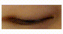
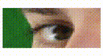
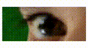
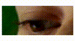
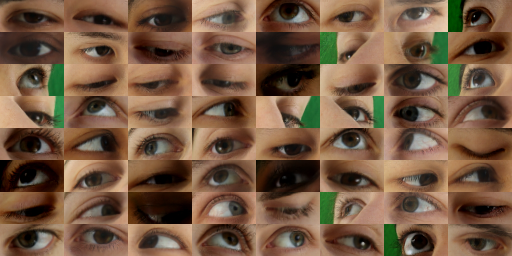
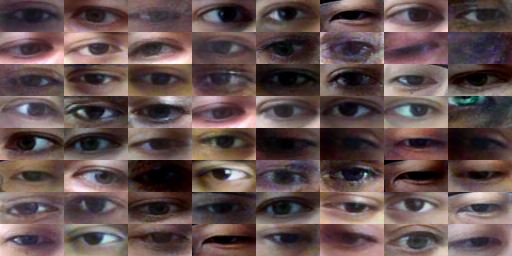
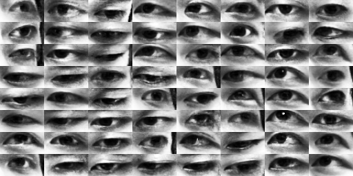
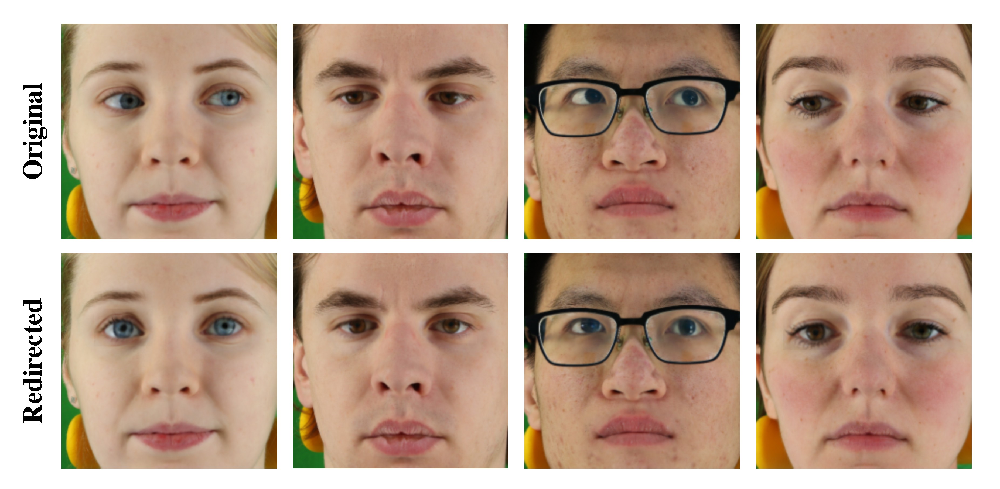
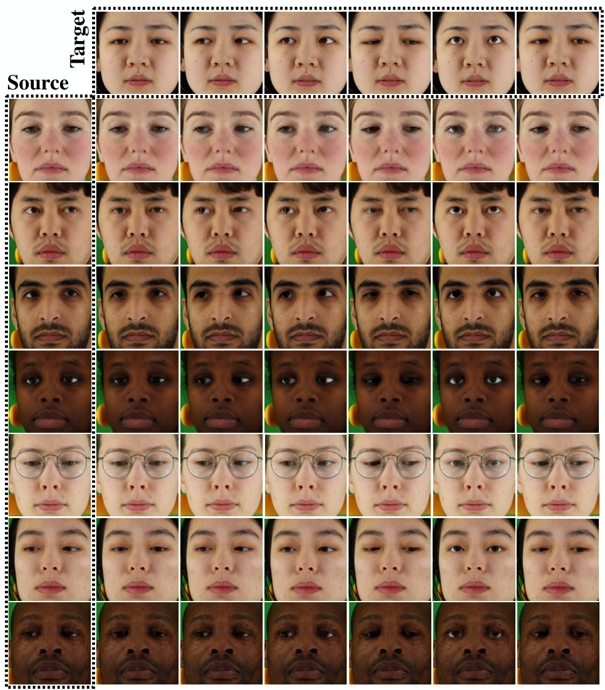

# GazeFlow
The offical implementation of our paper *GazeFlow: Gaze Redirection with Normalizing Flows.* [pdf](./assets/GazeFlow.pdf)

<!-- 


 -->







## Overview

- `model.py`: GazeFlow model.
- `train.py`: Trainer for GazeFlow.
- `evaluation.py`: Containing methods `encode` and `decode` for gaze redirection.
- `imgs`: Images for testing. Accessing more images for testing can be found in `GazeFlowDemo.ipynb`.
- `GazeFlowDemo.ipynb`: A pre-trained GazeFlow demo for testing. [DEMO](https://github.com/ackness/GazeFlow_demo) is now available.

## Package requirements

Our codes are based on `tensorflow 2.3` and open source normalizing flows package `TFGENZOO`. Codes should work fine on `tensorflow ≥ 2.3`. 
You can easily build your environment by ` pip install -r requirements.txt `.

## Data

### MPIIGaze (low resolution)

- Download MPIIGaze dataset from [official website](https://www.mpi-inf.mpg.de/departments/computer-vision-and-machine-learning/research/gaze-based-human-computer-interaction/appearance-based-gaze-estimation-in-the-wild).


### ETH-XGaze (high quality)

- Download ETH-XGaze dataset from [official website](https://ait.ethz.ch/projects/2020/ETH-XGaze/).


### UT-MultiView (gray-scale)

- Download UT-MultiView dataset from [official website](https://www.ut-vision.org/datasets/).


### Preprocess

Please check the `data/data_preprocess.py`, it provides a simple scripts for processing the MPIIGaze dataset.

If you want to train your own dataset, just keep the input format like this:

```python
{
    'right_eye': 
        {'img': right_eye_img, 'headpose': right_headpose, 'gaze': right_gaze},
    'left_eye': 
        {'img': left_eye_img, 'headpose': left_headpose, 'gaze': left_gaze},
}
```

## Train

```bash
CUDA_VISIBLE_DEVICES=0 python train.py --images-width=64 --images-height=32 --K=18 --L=3 --datapath=/your_path_to_preprocess_data/xgaze_64x32.tfrecords
```

## Test and pretrained model

We provided a ETH-XGaze pre-trained GazeFlow demo for gaze redirection. Check out [GazeFlow Colab Demo](https://colab.research.google.com/drive/1TALhnvy6CuyzpC29mS8CShZH3mpV8AAG?usp=sharing). Pre-trained model will be downloaded by running the notebook. For convenience, you can upload it to Colab and run it.

```bash
CUDA_VISIBLE_DEVICES=0 python train.py --BATCH-SIZE=32 --images-width=128 --images-height=128 --K=18 --L=5 --condition-shape=4 --total-take=34000 --datapath=/path_to_your_preprocessed_data/mpiiface.tfrecords
```

## More Image

### Samples

1. ETH-XGaze Samples



2. MPII-Gaze Samples



3. UT-MultiView Samples



4. Gaze Correction, Crop eyes image and paste back.



5. Full face gaze redirect, crop eyes and paste with poisson blending



## Pretrained Models

1. [ETH-XGaze-Redirection](https://drive.google.com/file/d/12eYcS4kVXVjF3gJdtWx7LFKvmQ_6Tspp/view?usp=sharing)

